# Windows11下VirtualBox搭建Ubuntu22.04

### 1. 下载Ubuntu镜像
从清华大学开源软件镜像站下载Ubuntu22.04镜像：
https://mirrors.tuna.tsinghua.edu.cn/ubuntu-releases/

### 2. 安装Ubuntu
- 设置节点名称：如ubuntu-master
- 设置节点文件夹：默认C盘，可换到其他磁盘
- 设置镜像文件：选择下载的镜像文件
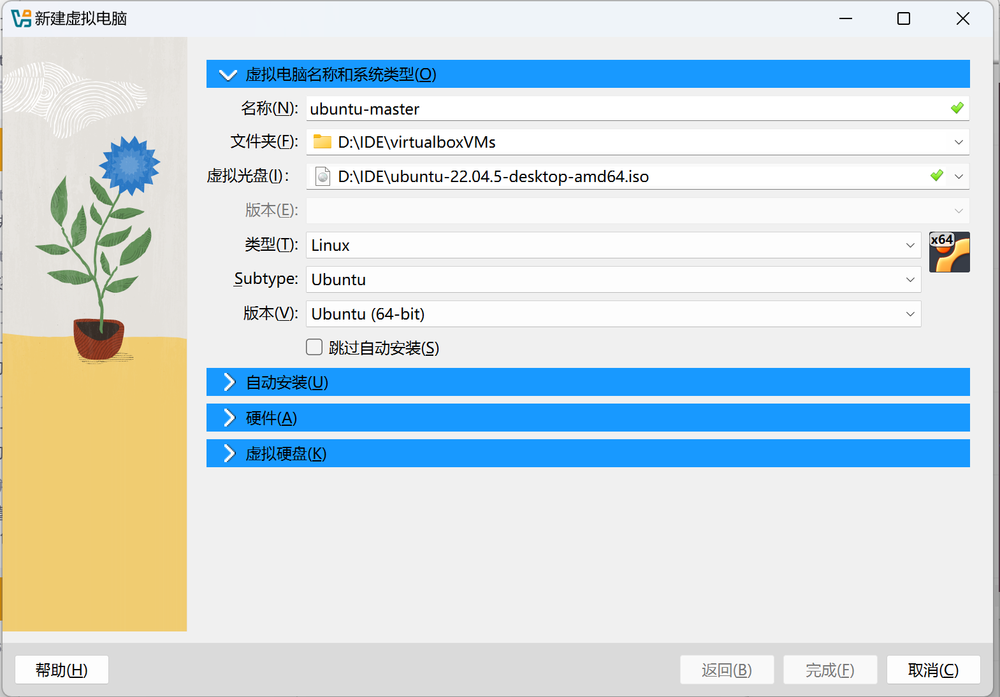
- 设置初始化账号
- 设置节点域名
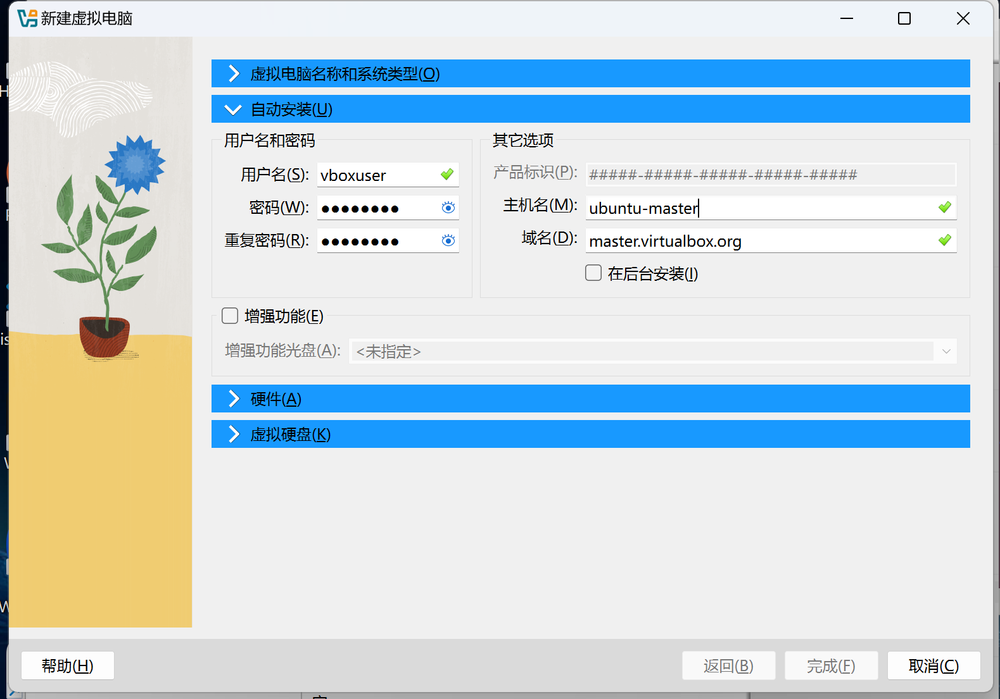
- 设置节点硬件配置：本文主要用来搭建Kubernetes集群，因此配置内存为2G，CPU为2核，硬盘为20G
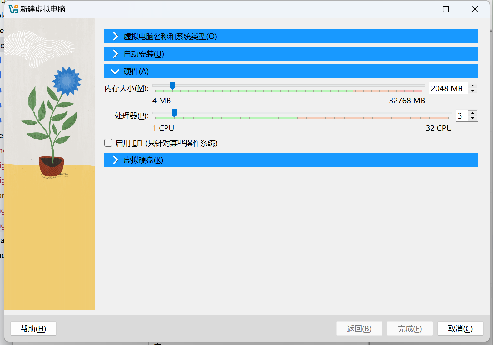
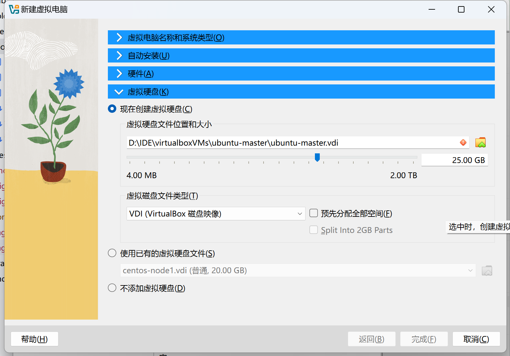
- 完成配置，等待Ubuntu自动安装，安装完成后，Ubuntu会自动重启，用预设账号登录系统
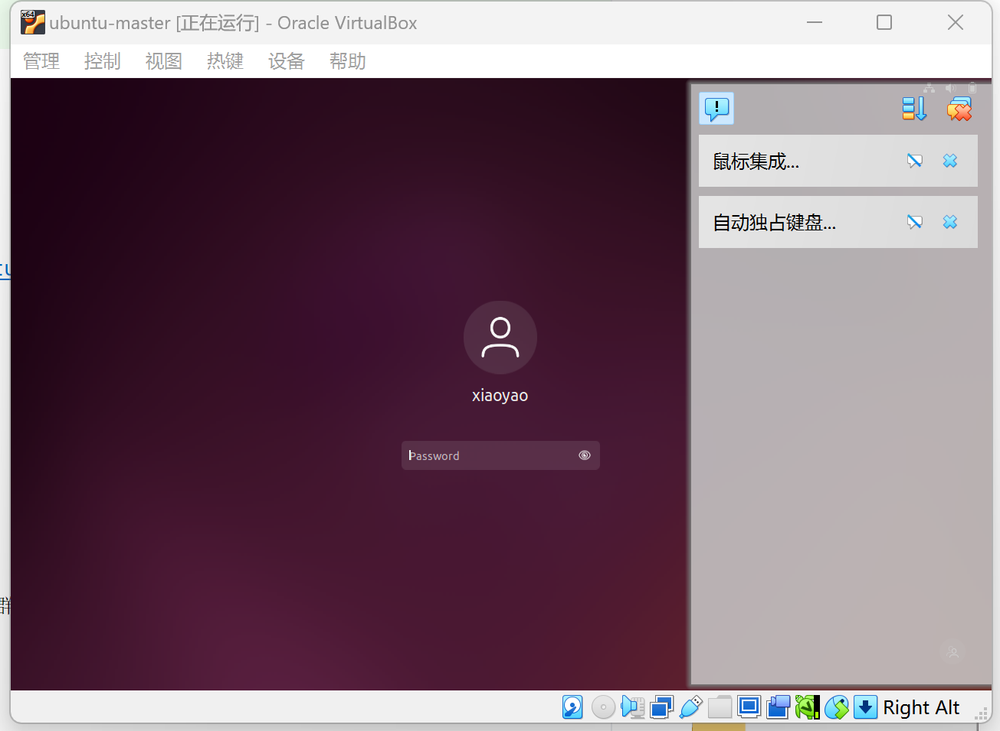
- 登录成功后，先将系统语言设置为中文，否则可能打不开Terminal
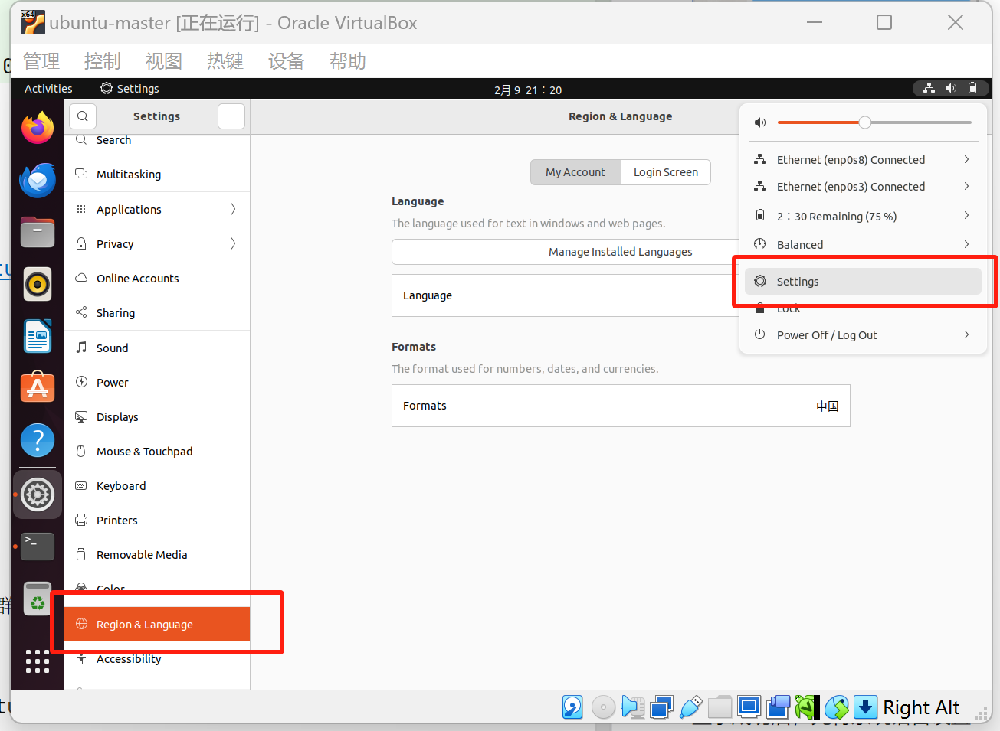
- 进入Terminal,使用su切换到root账户
- 安装vim
- 修改/etc/sudoers配置文件，将预设账户的权限改为ALL=(ALL:ALL) ALL
```bash
su 
apt-get update
apt-get install vim -y
vim /etc/sudoers
```
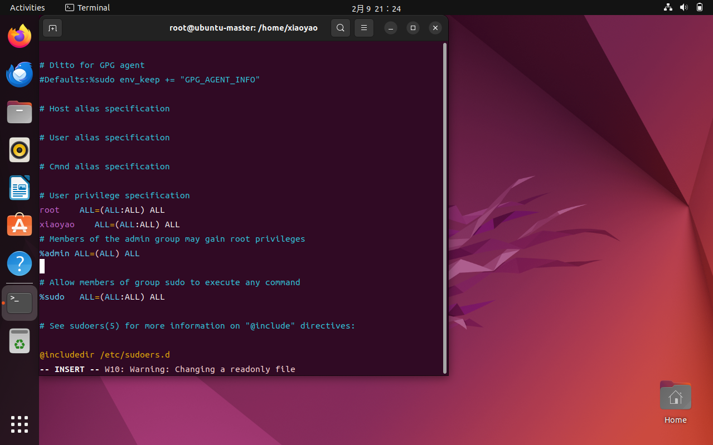
### 3. 配置网络
- 修改Ubuntu网络配置文件，为节点配置静态IP
```bash
vim /etc/netplan/01-network-manager-all.yaml
netplan apply
```
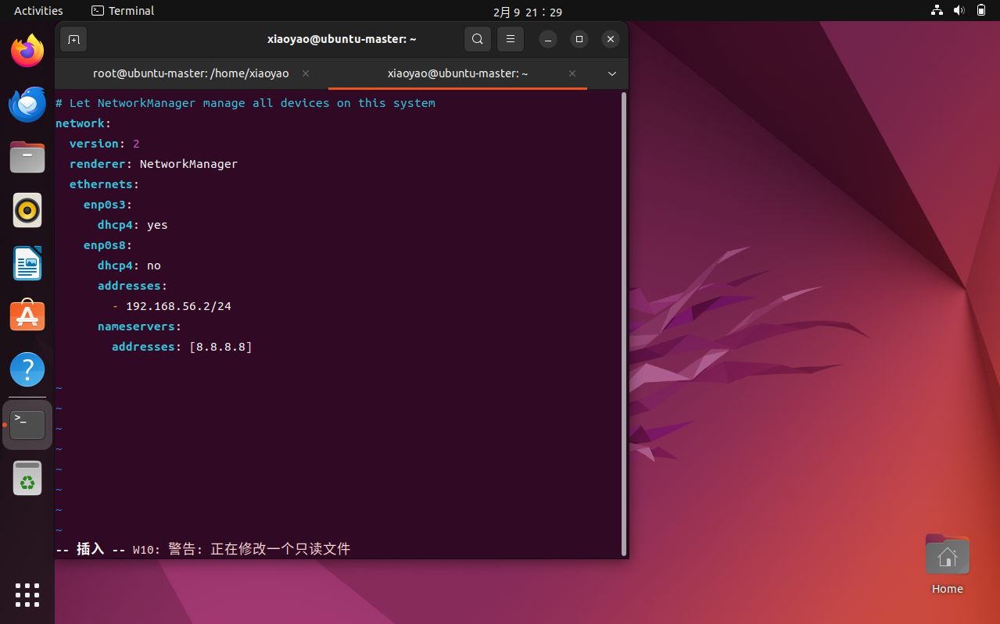
- 配置虚拟机网卡1+网卡2
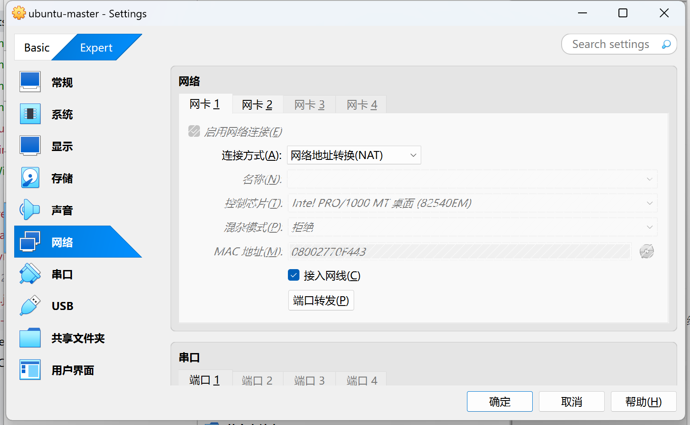
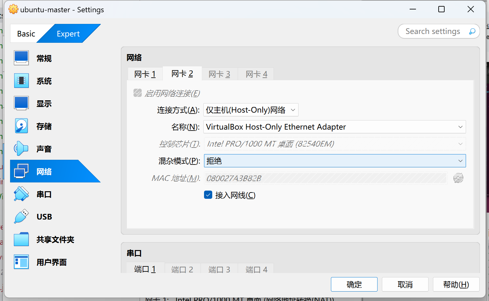
- 此时Windows应该可以ping通Ubuntu的IP
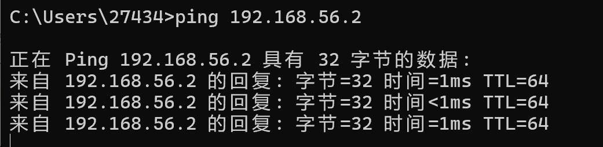
- 但是Ubuntu可能还Ping不通Windows的，需要给Windows设置如下图防火墙入站规则
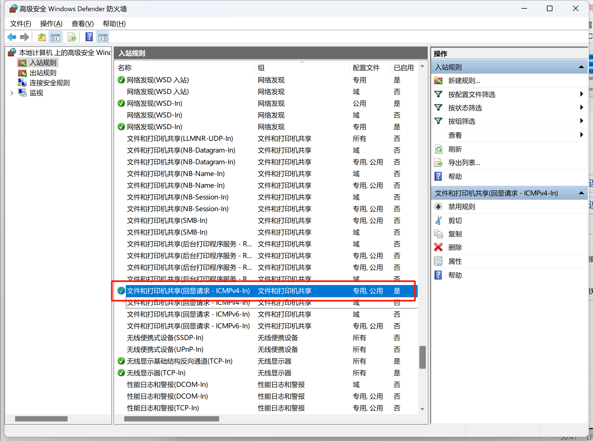
- 网络通了之后，我还想用ssh工具连接到Ubuntu，发现此时ssh不通，需要在Ubuntu下开启ssh\禁用firewall
```bash
su
apt-get install openssh-server -y
ufw disable
```
#### 至此，可以开始用Ubuntu搞事啦~